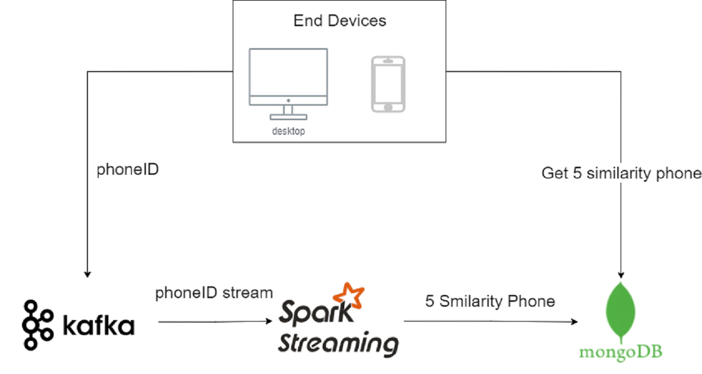
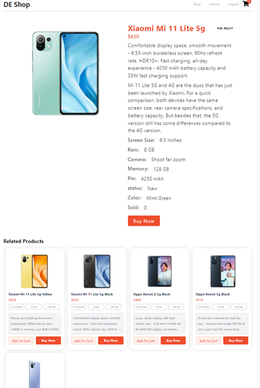

# Streaming Phone Recommender Systems
> A application using Apache Kafka, Spark Streaming to collect phone click activities of user and recommending similar products
> We used MERN Stack to create demo website

## Table of Contents
* [About The Project](#about-the-project)
* [Technologies Used](#technologies-used)
* [Setup](#setup)
* [Screenshots](#screenshots)
* [Project Status](#project-status)
* [Room for Improvement](#room-for-improvement)
* [Contact](#contact)
<!-- * [License](#license) -->

## About The Project
- The owner of an online phone store wants to add the function of suggesting similar phone models to customers when a customer clicks on a phone.

- When a customer clicks on a product, the phone id is propagated down to kafka, which then continues through spark streaming. Here, we perform similar product retrieval based on the elements 'title', 'category', 'color', 'memory', 'battery', 'ram', 'screenSize', 'price' of the items. other phones in the database using RMSE. The output is the 5 phone ids with the highest similarity.

- Those 5 ids will be saved in mongo db. 5s since user click, nodejs automatically get 5 same phone id in mongo and display on web

- System Architect:

## Technologies Used
- Apache zookeeper 3.7.0
- Apache Kafka     2.12-2.8.0
- Apache Spark     3.0.2 
- Apache Hadoop    2.7
- Java             jre-8u291
- Python           3.6.8

### Setup
_Following "./Guide/Setup and Launch Tutorial.docx"_

## Screenshots

## Project Status
Project is: _complete_

## Room for Improvement
Room for improvement:
- Add some machine learning recommendation model like Content-based systems Collaborative filtering in Spark Streaming for better suggestion.
- Use socket.io to display immediately result instead of wait 5s.

## Contact
- [Vũ Nguyễn](https://github.com/vunguyen22271)
- [Hiếu Lê](https://github.com/hieuLapTop77)